# Git

## Git安装

```shell
sudo apt install git
```

## Git配置

Git 提供了一个叫做 git config 的工具，专门用来配置或读取相应的工作环境变量。这些环境变量，决定了 Git 在各个环节的具体工作方式和行为。这些变量可以存放在以下三个不同的地方：

- `/etc/gitconfig` 文件：系统中对所有用户都普遍适用的配置。若使用 `git config` 时用 `--system` 选项，读写的就是这个文件。
- `~/.gitconfig` 文件：用户目录下的配置文件**只适用于该用户**。若使用 `git config` 时用 `--global` 选项，读写的就是这个文件。
- 当前项目的 Git 目录中的配置文件（也就是工作目录中的 `.git/config` 文件）：只要去掉` --global` 选项重新配置即可，这里的配置仅仅针对当前项目有效。每一个级别的配置都会覆盖上层的相同配置，所以 `.git/config` 里的配置会覆盖 `/etc/gitconfig` 中的同名变量。


```shell
git config --global user.name ""
git config --global user.email ""
```

### 暂存区

将文件往 Git 版本仓库中添加的时候，是分两步执行的：

1. 用`git add`把文件添加进去，实际上就是把文件修改添加到暂存区；

2. 用`git commit`提交更改，实际上就是把暂存区的所有内容提交到当前分支。

   


## Git使用

有些时候，在必须把某些文件放到 Git 工作目录中，但又不能提交它们时，比如保存了数据库密码的配置文件等等。我们就需要在工作目录下创建一个`.gitignore`文件，然后把要忽略的文件名填进去，这样 Git 就会自动忽略这些文件了。

有哪些文件是需要忽略的呢？有以下几种：

1. 操作系统自动生成的文件，比如缩略图等；
2. 编译生成的中间文件、可执行文件，也就是如果一个文件是通过另一个文件自动生成的，那自动生成的文件就没有必要放进版本仓库;
3. 带有敏感信息的配置文件，比如存放数据库密码的配置文件等。

### 基础使用

#### 提交

`git commit`在当前的分支下提交修改记录，如果没有修改分支的情况下，位于master分支；


#### 创建分支

`git branch newImage`创建newImage分支，但是在没有切换分支的情况下，仍然处于master分支；

#### 切换分支

`git checkout newImage`切换分支的命令，切换到newImage分支；


#### 合并

`git merge bugFix`将`bugFix`合并到`master`

**注**：**merge是将其后所指定的节点合并到HEAD指向的节点，并在HEAD指向的节点下延长**


`git rebase`，Rebase 实际上就是取出一系列的提交记录，“复制”它们，然后在另外一个地方逐个的放下去；Rebase 的优势就是可以创造更线性的提交历史。

1. 新建并切换到 `bugFix` 分支  

   `git branch bugFix; git checkout bugFix`

2. 提交一次

   `git commit`

3. 切换回 `master` 分支再提交一次

   `git checkout master; git commit`

4. 再次切换到 `bugFix` 分支，`rebase` 到 `master `上

   `git checkout bugFix; git rebase master`

   

### 进阶使用

在提交树上移动

从 `bugFix` 分支中分离出 HEAD 并让其指向一个提交记录。

`git checkout C4`


#### 相对引用

通过指定提交记录哈希值的方式在 Git 中移动不太方便。在实际应用时，并没有像本程序中这么漂亮的可视化提交树供你参考，所以你就不得不用 `git log` 来查查看提交记录的哈希值。通过哈希值指定提交记录很不方便，所以 Git 引入了**相对引用**。使用相对引用的话，你就可以从一个易于记忆的地方（比如 `bugFix` 分支或 `HEAD`）开始计算。

相对引用非常给力，这里我介绍两个简单的用法：

- 使用 `^` 向上移动 1 个提交记录
- 使用 `~` 向上移动多个提交记录，如 `~3`

首先看看操作符 (^)。把这个符号加在引用名称的后面，表示让 Git 寻找指定提交记录的父提交。所以 `master^` 相当于“`master` 的父节点”；`master^^` 是 `master` 的第二个父节点。

`git checkout HEAD~4`


`git checkout bugFix^`


#### 强制修改分支位置

可以直接使用 `-f` 选项让分支指向另一个提交。例如:

```shell
git branch -f master HEAD~3
```


上面的命令会将 master 分支强制指向 HEAD 的第 3 级父提交。


```shell
git branch -f master C6
git checkout HEAD^
git branch -f bugFix HEAD^
```


#### 变更撤销

主要有两种方法用来撤销变更：`git reset`和 `git revert`。

`git reset` 向上移动分支，原来指向的提交记录就跟从来没有提交过一样。

`git reset HEAD~1`


Git 把 master 分支移回到 `C1`；现在我们的本地代码库根本就不知道有 `C2` 这个提交了。（注：在reset后， `C2` 所做的变更还在，但是处于未加入暂存区状态。）

虽然在你的本地分支中使用 `git reset` 很方便，但是这种“改写历史”的方法对大家一起使用的远程分支是无效的哦！为了撤销更改并**分享**给别人，我们需要使用 `git revert`。

`git revert HEAD`


奇怪！在我们要撤销的提交记录后面居然多了一个新提交！这是因为新提交记录 `C2'` 引入了**更改** —— 这些更改刚好是用来撤销 `C2` 这个提交的。也就是说 `C2'` 的状态与 `C1`是相同的。`revert` 之后就可以把你的更改推送到远程仓库与别人分享啦。


```shell
git reset local^
git checkout pushed
git revert pushed
```


#### 整理提交分支

如果你想将一些提交复制到当前所在的位置（`HEAD`）下面的话， Cherry-pick 是最直接的方式了。

- `git cherry-pick <提交号>...`


`git cherry-pick C2 C4`


当你知道你所需要的提交记录（**并且**还**知道这些提交记录的哈希值**）时, 用 cherry-pick 再好不过了 —— 没有比这更简单的方式了。但是如果你不清楚你想要的提交记录的哈希值呢? 幸好 Git 帮你想到了这一点, 我们可以利用交互式的 rebase —— 如果你想从一系列的提交记录中找到想要的记录, 这就是最好的方法了。

交互式 rebase 指的是使用带参数 `--interactive` 的 rebase 命令, 简写为 `-i`。如果你在命令后增加了这个选项，Git 会打开一个 UI 界面并列出将要被复制到目标分支的备选提交记录，它还会显示每个提交记录的哈希值和提交说明，提交说明有助于你理解这个提交进行了哪些更改。

当 rebase UI界面打开时, 你能做3件事:

- 调整提交记录的顺序（通过鼠标拖放来完成）
- 删除你不想要的提交（通过切换 `pick` 的状态来完成，关闭就意味着你不想要这个提交记录）
- 合并提交。 它允许你把多个提交记录合并成一个。

`git rebase -i HEAD~4` 

#### 本地栈式提交

你之前在 `newImage` 分支上进行了一次提交，然后又基于它创建了 `caption` 分支，然后又提交了一次。此时你想对的某个以前的提交记录进行一些小小的调整。比如设计师想修改一下 `newImage` 中图片的分辨率，尽管那个提交记录并不是最新的了。

我们可以通过下面的方法来克服困难：

- 先用 `git rebase -i` 将提交重新排序，然后把我们想要修改的提交记录挪到最前

- 然后用 `git commit --amend` 来进行一些小修改

- 接着再用 `git rebase -i` 来将他们调回原来的顺序

- 最后我们把 master 移到修改的最前端（用你自己喜欢的方法），就大功告成啦！

  

  ```shell
  git rebase -i HEAD~2
  git commit --amend
  git rebase -i HEAD~2
  git checkout master
  git branch -f master caption
  ```

  

 cherry-pick 可以将提交树上任何地方的提交记录取过来追加到 HEAD 上（只要不是 HEAD 上游的提交就没问题）。使用`git cherry-pick`实现上面类似的功能。

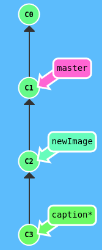

```shell
git checkout master
git cherry-pick newImage
git commit --amend
git cherry-pick caption
```

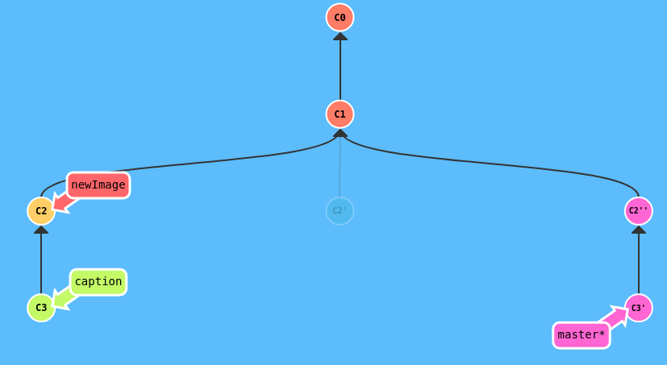

**永远指向某个提交记录的标识**

Git 的 tag 就是干这个用的啊，它们可以（在某种程度上 —— 因为标签可以被删除后重新在另外一个位置创建同名的标签）永久地将某个特定的提交命名为里程碑，然后就可以像分支一样引用了。更难得的是，它们并不会随着新的提交而移动。你也不能检出到某个标签上面进行修改提交，它就像是提交树上的一个锚点，标识了某个特定的位置。

`git tag v1 C1`

我们将这个标签命名为 `v1`，并且明确地让它指向提交记录 `C1`，如果你不指定提交记录，Git 会用 `HEAD` 所指向的位置。

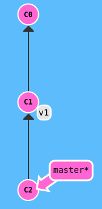

由于标签在代码库中起着“锚点”的作用，Git 还为此专门设计了一个命令用来**描述**离你最近的锚点（也就是标签），它就是 `git describe`！Git Describe 能帮你在提交历史中移动了多次以后找到方向；当你用 `git bisect`（一个查找产生 Bug 的提交记录的指令）找到某个提交记录时，或者是当你坐在你那刚刚度假回来的同事的电脑前时， 可能会用到这个命令。

`git describe` 的语法是：

```shell
git describe <ref>
```

`<ref>` 可以是任何能被 Git 识别成提交记录的引用，如果你没有指定的话，Git 会以你目前所检出的位置（`HEAD`）。

它输出的结果是这样的：

```shell
<tag>_<numCommits>_g<hash>
```

`tag` 表示的是离 `ref` 最近的标签， `numCommits` 是表示这个 `ref` 与 `tag` 相差有多少个提交记录， `hash` 表示的是你所给定的 `ref` 所表示的提交记录哈希值的前几位。当 `ref` 提交记录上有某个标签时，则只输出标签名称


`git describe master` 会输出：`v1_2_gC2`

`git describe side` 会输出：`v2_1_gC4`

**多分支rebase**

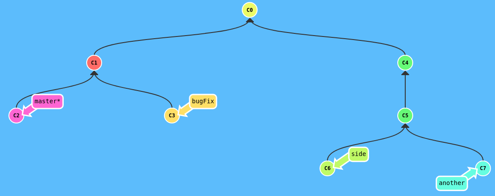

```shell
git rebase master bugFix
git rebase bugFix side
git rebase side another
git rebase another master
```

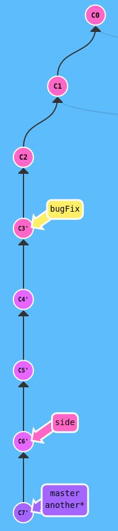

#### 选择父提交记录

操作符 `^` 与 `~` 符一样，后面也可以跟一个数字。
但是该操作符后面的数字与 `~` 后面的不同，并不是用来指定向上返回几代，而是指定合并提交记录的某个父提交。还记得前面提到过的一个合并提交有两个父提交吧，所以遇到这样的节点时该选择哪条路径就不是很清晰了。
Git 默认选择合并提交的“第一个”父提交，在操作符 `^` 后跟一个数字可以改变这一默认行为。

这里有一个合并提交记录。如果不加数字修改符直接检出 `master^`，会回到第一个父提交记录。(*在我们的图示中，第一个父提交记录是指合并提交记录正上方的那个提交记录。*)

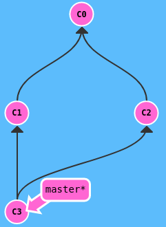

- `git checkout HEAD~^2~2`

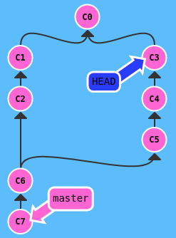

例子：

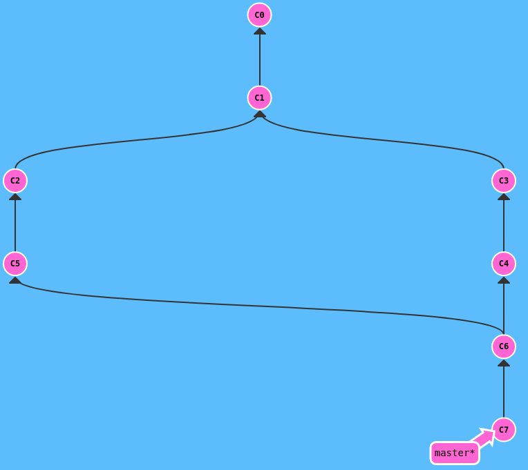

`git branch bugWork HEAD^^2^`

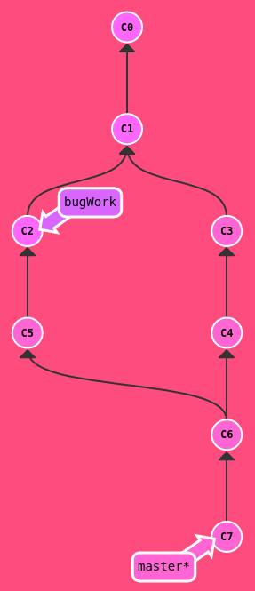

## 远程仓库

### 远程分支

远程分支反映了远程仓库(在你上次和它通信时)的**状态**。这会有助于你理解本地的工作与公共工作的差别 —— 这是你与别人分享工作成果前至关重要的一步.远程分支有一个特别的属性，在你检出时自动进入分离 HEAD 状态。Git 这么做是出于不能直接在这些分支上进行操作的原因, 你必须在别的地方完成你的工作, （更新了远程分支之后）再用远程分享你的工作成果。

你可能想问这些远程分支的前面的 `o/` 是什么意思呢？好吧, 远程分支有一个命名规范 —— 它们的格式是:

- `<remote name>/<branch name>`

因此，如果你看到一个名为 `o/master` 的分支，那么这个分支就叫 `master`，远程仓库的名称就是 `o`。大多数的开发人员会将它们主要的远程仓库命名为 `origin`，并不是 `o`。这是因为当你用 `git clone` 某个仓库时，Git 已经帮你把远程仓库的名称设置为 `origin` 了。

`git checkout o/master; git commit`

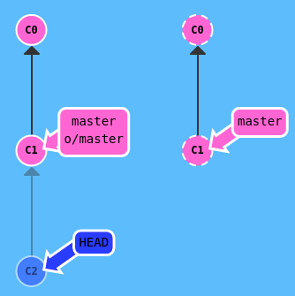

正如你所见，Git 变成了分离 HEAD 状态，当添加新的提交时 `o/master` 也不会更新。这是因为 `o/master` 只有在远程仓库中相应的分支更新了以后才会更新。

### Git fetch

从远程仓库获取数据,你会看到当我们从远程仓库获取数据时, 远程分支也会更新以反映最新的远程仓库。

`git fetch` 完成了仅有的但是很重要的两步:

- 从远程仓库下载本地仓库中缺失的提交记录
- 更新远程分支指针(如 `o/master`)

`git fetch` 实际上将本地仓库中的远程分支更新成了远程仓库相应分支最新的状态。远程分支反映了远程仓库在你**最后一次与它通信时**的状态，`git fetch` 就是你与远程仓库通信的方式了！


`git fetch` 并不会改变你本地仓库的状态。它不会更新你的 `master` 分支，也不会修改你磁盘上的文件。

### Git pull

既然我们已经知道了如何用 `git fetch` 获取远程的数据, 现在我们学习如何将这些变化更新到我们的工作当中。

其实有很多方法的 —— 当远程分支中有新的提交时，你可以像合并本地分支那样来合并远程分支。也就是说就是你可以执行以下命令:

- `git cherry-pick o/master`
- `git rebase o/master`
- `git merge o/master`
- 等等

实际上，由于先抓取更新再合并到本地分支这个流程很常用，因此 Git 提供了一个专门的命令来完成这两个操作。它就是我们要讲的 `git pull`。


```shell
git fetch
git merge o/master
```

我们用 `fetch` 下载了 `C3`, 然后通过 `git merge o/master` 合并了这一提交记录。现在我们的 `master` 分支包含了远程仓库中的更新（在本例中远程仓库名为 `origin`）


使用`git pull`可以得到同样的结果

### 模拟团队合作

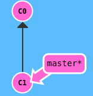

```shell
git clone
git fakeTeamwork 2
git commit
git pull
```

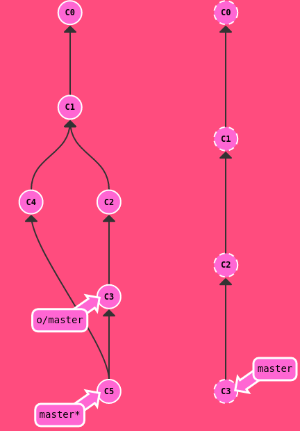

### Git push


`git push`


远程仓库接收了 `C2`，远程仓库中的 `master` 分支也被更新到指向 `C2` 了，我们的远程分支 (o/master) 也同样被更新了。所有的分支都同步了！

### 偏离

假设你周一克隆了一个仓库，然后开始研发某个新功能。到周五时，你新功能开发测试完毕，可以发布了。但是 —— 天啊！你的同事这周写了一堆代码，还改了许多你的功能中使用的 API，这些变动会导致你新开发的功能变得不可用。但是他们已经将那些提交推送到远程仓库了，因此你的工作就变成了基于项目**旧版**的代码，与远程仓库最新的代码不匹配了。

这种情况下, `git push` 就不知道该如何操作了。如果你执行 `git push`，Git 应该让远程仓库回到星期一那天的状态吗？还是直接在新代码的基础上添加你的代码，亦或由于你的提交已经过时而直接忽略你的提交？

因为这情况（历史偏离）有许多的不确定性，Git 是不会允许你 `push` 变更的。实际上它会强制你先合并远程最新的代码，然后才能分享你的工作。


`git push` 失败是因为你最新提交的 `C3` 基于远程分支中的 `C1`。而远程仓库中该分支已经更新到 `C2` 了，所以 Git 拒绝了你的推送请求。

解决方法：

1. 我们用 `git fetch` 更新了本地仓库中的远程分支，然后用 rebase 将我们的工作移动到最新的提交记录下，最后再用 `git push` 推送到远程仓库。

   ```shell
   git fetch
   git rebase o/master
   git push
   #同样的功能
   git pull --rebase
   git push
   ```


2. 我们用 `git fetch` 更新了本地仓库中的远程分支，然后**合并**了新变更到我们的本地分支（为了包含远程仓库的变更），最后我们用 `git push` 把工作推送到远程仓库

   ```shell
   git fetch
   git merge o/master
   git push
   #同样的功能
   git pull
   git push
   ```

   

### 远程服务器拒绝

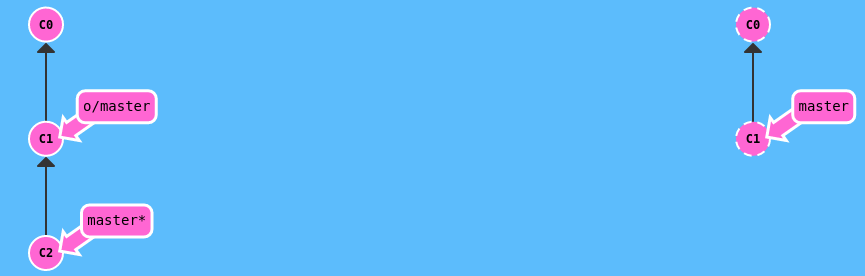

如果你是在一个大的合作团队中工作, 很可能是master被锁定了, 需要一些Pull Request流程来合并修改。如果你直接提交(commit)到本地master, 然后试图推送(push)修改, 你将会收到这样类似的信息:

```shell
! [远程服务器拒绝] master -> master (TF402455: 不允许推送(push)这个分支; 你必须使用pull request来更新这个分支.)
```

远程服务器拒绝直接推送(push)提交到master, 因为策略配置要求 pull requests 来提交更新.

你应该按照流程, 新建一个分支, 推送(push)这个分支并申请pull request,但是你忘记并直接提交给了master.现在你卡住并且无法推送你的更新.

**解决办法**

新建一个分支feature, 推送到远程服务器. 然后reset你的master分支和远程服务器保持一致, 否则下次你pull他人的提交和你冲突的时候就会有问题.

```shell
git reset o/master
git checkout -b feature C2
git push origin feature
```

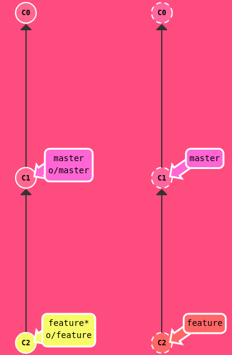

### 合并特性分支

在大型项目中开发人员通常会在（从 `master` 上分出来的）特性分支上工作，工作完成后只做一次集成。这跟前面课程的描述很相像（把 side 分支推送到远程仓库），不过本节我们会深入一些.

但是有些开发人员只在 master 上做 push、pull —— 这样的话 master 总是最新的，始终与远程分支 (o/master) 保持一致。

对于接下来这个工作流，我们集成了两个步骤：

- 将特性分支集成到 `master` 上
- 推送并更新远程分支

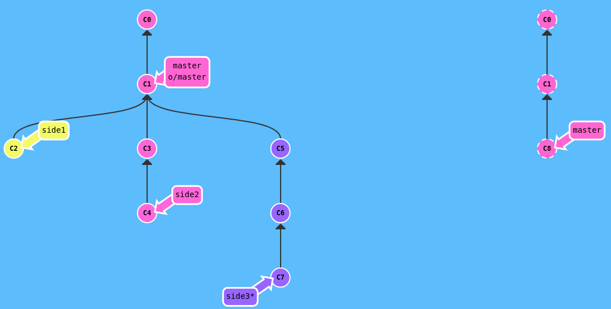

```shell
git fecth
git rebase o/master side1
git rebase side1 side2
git rebase side2 side3
git rebase side3 master
git push
```

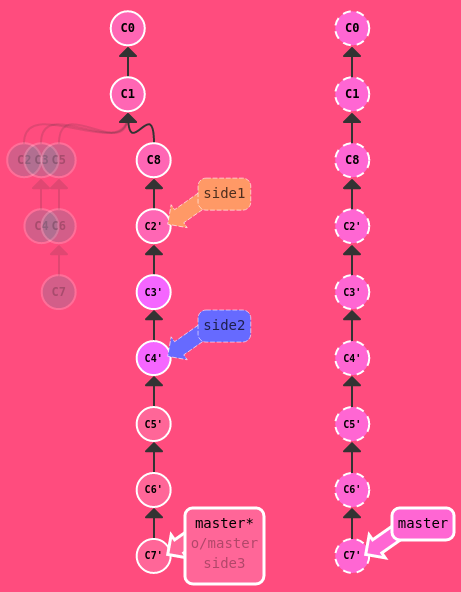

为了 push 新变更到远程仓库，你要做的就是**包含**远程仓库中最新变更。意思就是只要你的本地分支包含了远程分支（如 `o/master`）中的最新变更就可以了，至于具体是用 rebase 还是 merge，并没有限制。

那么既然没有规定限制，为何前面都在着重于 rebase 呢？为什么在操作远程分支时不喜欢用 `merge` 呢？

在开发社区里，有许多关于 merge 与 rebase 的讨论。以下是关于 rebase 的优缺点：

优点:

- Rebase 使你的提交树变得很干净, 所有的提交都在一条线上

缺点:

- Rebase 修改了提交树的历史

比如, 提交 C1 可以被 rebase 到 C3 之后。这看起来 C1 中的工作是在 C3 之后进行的，但实际上是在 C3 之前。一些开发人员喜欢保留提交历史，因此更偏爱 merge。

**merge方法**

```shell
git checkout master
git pull
git merge side1
git merge side2
git merge side3
git push
```

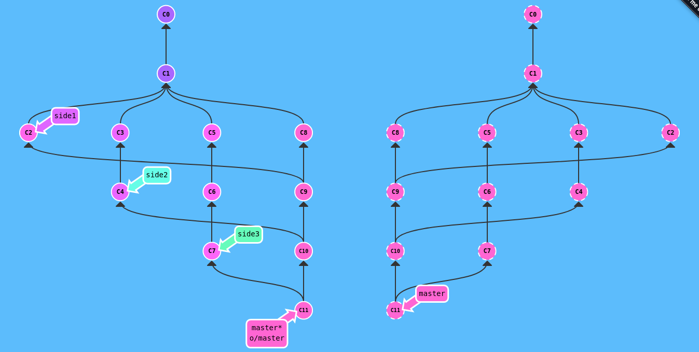

### 远程跟踪分支

在前面的练习过程中有件事儿挺神奇的，Git 好像知道 `master` 与 `o/master` 是相关的。当然这些分支的名字是相似的，可能会让你觉得是依此将远程分支 master 和本地的 master 分支进行了关联。这种关联在以下两种情况下可以清楚地得到展示：

- pull 操作时, 提交记录会被先下载到 o/master 上，之后再合并到本地的 master 分支。隐含的合并目标由这个关联确定的。
- push 操作时, 我们把工作从 `master` 推到远程仓库中的 `master` 分支(同时会更新远程分支 `o/master`) 。这个推送的目的地也是由这种关联确定的！

直接了当地讲，`master` 和 `o/master` 的关联关系就是由分支的“remote tracking”属性决定的。`master` 被设定为跟踪 `o/master` —— 这意味着为 `master` 分支指定了推送的目的地以及拉取后合并的目标。你可能想知道 `master` 分支上这个属性是怎么被设定的，你并没有用任何命令指定过这个属性呀！好吧, 当你克隆仓库的时候, Git 就自动帮你把这个属性设置好了。当你克隆时, Git 会为远程仓库中的每个分支在本地仓库中创建一个远程分支（比如 `o/master`）。然后再创建一个跟踪远程仓库中活动分支的本地分支，默认情况下这个本地分支会被命名为 `master`。
克隆完成后，你会得到一个本地分支（如果没有这个本地分支的话，你的目录就是“空白”的），但是可以查看远程仓库中所有的分支（如果你好奇心很强的话）。这样做对于本地仓库和远程仓库来说，都是最佳选择。
这也解释了为什么会在克隆的时候会看到下面的输出：

```shell
local branch "master" set to track remote branch "o/master"
```

**可以自行更改该属性**

你可以让任意分支跟踪 `o/master`, 然后该分支会像 `master` 分支一样得到隐含的 push 目的地以及 merge 的目标。 这意味着你可以在分支 `totallyNotMaster` 上执行 `git push`，将工作推送到远程仓库的 `master` 分支上。

有两种方法设置这个属性

#### 第一种方法

第一种就是通过远程分支检出一个新的分支，执行:

```shell
git checkout -b totallyNotMaster o/master
```

就可以创建一个名为 `totallyNotMaster` 的分支，它跟踪远程分支 `o/master`。

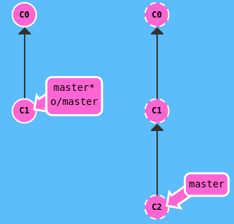

```shell
git checkout -b foo o/master
git pull
```

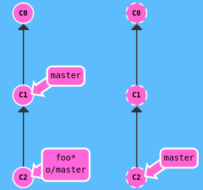

正如你所看到的, 我们使用了隐含的目标 `o/master` 来更新 `foo` 分支。需要注意的是 master 并未被更新！

#### 第二种方法

使用：`git branch -u` 命令（该命令的前提是已经有foo分支），执行：

```shell
git branch -u o/master foo
```

这样 `foo` 就会跟踪 `o/master` 了。如果当前就在 foo 分支上, 还可以省略 foo：

```shell
git branch -u o/master
```

案例：

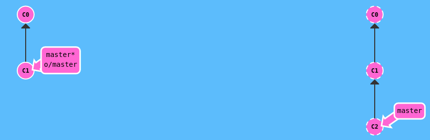

```shell
git checkout -b side o/master
git commit
git pull --rebase
git push
```

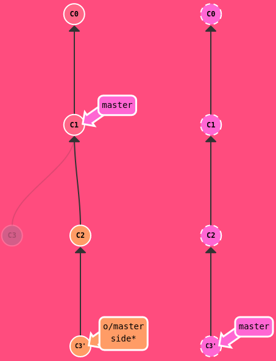

### Git push参数

在远程跟踪中，我们已经了解了 Git 是通过当前检出分支的属性来确定远程仓库以及要 push 的目的地的。这是未指定参数时的行为，我们可以为 push 指定参数，语法是：`git push <remote> <place>`

`<place>` 参数是什么意思呢？我们稍后会深入其中的细节, 先看看例子, 这个命令是:

`git push origin master`

把这个命令翻译过来就是：

*切到本地仓库中的“master”分支，获取所有的提交，再到远程仓库“origin”中找到“master”分支，将远程仓库中没有的提交记录都添加上去，搞定之后告诉我。*

我们通过“place”参数来告诉 Git 提交记录来自于 master, 要推送到远程仓库中的 master。它实际就是要同步的两个仓库的位置。

需要注意的是，因为我们通过指定参数告诉了 Git 所有它需要的信息, 所以它就忽略了我们所检出的分支的属性！


```shell
git push origin foo
git push origin master
```


#### `<place>`参数详解

当为 git push 指定 place 参数为 `master` 时，我们同时指定了提交记录的来源和去向。

你可能想问 —— 如果来源和去向分支的名称不同呢？比如你想把本地的 `foo` 分支推送到远程仓库中的 `bar` 分支。哎，很遗憾 Git 做不到…… 开个玩笑，别当真！当然是可以的啦 :) Git 拥有超强的灵活性（有点过于灵活了）

要同时为源和目的地指定 `<place>` 的话，只需要用冒号 `:` 将二者连起来就可以了：

```shell
git push origin <source>:<destination>
```

这个参数实际的值是个 refspec，“refspec” 是一个自造的词，意思是 Git 能识别的位置（比如分支 `foo` 或者 `HEAD~1`），一旦你指定了独立的来源和目的地，就可以组织出言简意赅的远程操作命令了，让我们看看演示！

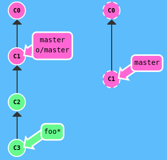

`git push origin foo^:master`

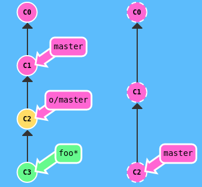

### Git fetch参数

我们刚刚学习了 git push 的参数，很酷的 `<place>` 参数，还有用冒号分隔的 refspecs（`<source>:<destination>`）。 这些参数可以用于 `git fetch` 吗？你猜中了！`git fetch` 的参数和 `git push` 极其相似。他们的概念是相同的，只是方向相反罢了（因为现在你是下载，而非上传）

#### `<place>`参数

如果你像如下命令这样为 git fetch 设置 的话：`git fetch origin foo`

Git 会到远程仓库的 `foo` 分支上，然后获取所有本地不存在的提交，放到本地的 `o/foo` 上。


`git fetch origin foo`


我们只下载了远程仓库中 `foo` 分支中的最新提交记录，并更新了 o/foo

你可能会好奇 —— 为何 Git 会将新提交放到 `o/foo` 而不是放到我本地的 foo 分支呢？之前不是说这样的 参数就是同时应用于本地和远程的位置吗？好吧, 本例中 Git 做了一些特殊处理，因为你可能在 foo 分支上的工作还未完成，你也不想弄乱它。还记得在 `git fetch` 课程里我们讲到的吗 —— 它不会更新你的本地的非远程分支, 只是下载提交记录（这样, 你就可以对远程分支进行检查或者合并了）。

“如果我们指定 `<source>:<destination>` 会发生什么呢？”

如果你觉得直接更新本地分支很爽，那你就用冒号分隔的 refspec 吧。不过，你不能在当前检出的分支上干这个事，但是其它分支是可以的。

这里有一点是需要注意的 —— `source` 现在指的是远程仓库中的位置，而 `<destination>` 才是要放置提交的本地仓库的位置。它与 git push 刚好相反，这是可以讲的通的，因为我们在往相反的方向传送数据。

理论上虽然行的通，但开发人员很少这么做。我在这里介绍它主要是为了从概念上说明 `fetch` 和 `push` 的相似性，只是方向相反罢了。

### `<source>用法`

Git 有两种关于 `<source>` 的用法是比较诡异的，即你可以在 git push 或 git fetch 时不指定任何 `source`，方法就是仅保留冒号和 destination 部分，source 部分留空。

- `git push origin :side`
- `git fetch origin :bugFix`

我们分别来看一下这两条命令的作用……

如果 push 空 到远程仓库会如何呢？它会删除远程仓库中的分支！

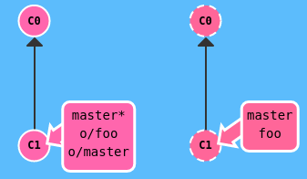

`git push origin :foo`

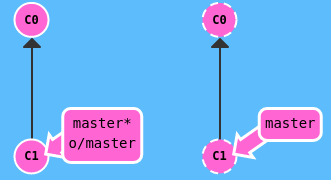

我们通过给 push 传空值 source，成功删除了远程仓库中的 `foo` 分支

如果 fetch 空 到本地，会在本地创建一个新分支。

### Git pull参数

既然你已经掌握关于 `git fetch` 和 `git push` 参数的方方面面了，关于 git pull 几乎没有什么可以讲的了 :)

因为 git pull 到头来就是 fetch 后跟 merge 的缩写。你可以理解为用同样的参数执行 git fetch，然后再 merge 你所抓取到的提交记录。

以下命令在 Git 中是等效的:

`git pull origin foo` 相当于：`git fetch origin foo; git merge o/foo`

还有...

`git pull origin bar~1:bugFix` 相当于：

`git fetch origin bar~1:bugFix; git merge bugFix`

看到了? git pull 实际上就是 fetch + merge 的缩写, git pull 唯一关注的是提交最终合并到哪里（也就是为 git fetch 所提供的 destination 参数）